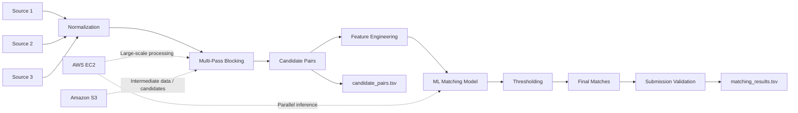

<div align="center">

# 🔍 Business Entity Resolution

### Amazon ML Challenge 2026

**Scalable • Multi-Pass Blocking • ML-Based Entity Matching • Multi-Match Resolution**

[](https://www.python.org/)
[](https://duckdb.org/)
[](https://github.com/rapidfuzz/RapidFuzz)
[](https://aws.amazon.com/)

</div>

---

# 📌 Overview

This repository contains our solution for the **Business Entity Resolution** challenge in the **Amazon ML Challenge 2026**.

The objective is to identify, for every **Source 1 (S1)** business entity, all corresponding records from **Source 2 (S2)** and **Source 3 (S3)**.

The challenge allows:

- Zero matching records
- One matching record
- Multiple matching records

Therefore, the solution treats entity resolution as a **multi-match problem** rather than assuming one-to-one relationships.

The complete workflow combines:

- Data preprocessing
- Text normalization
- Transliteration
- Multi-pass blocking
- Candidate generation
- Candidate recall analysis
- Feature engineering
- Machine-learning based matching
- Threshold selection
- Large-scale inference
- Parallel processing
- AWS EC2 infrastructure
- S3-based intermediate data storage
- Submission validation

The implementation uses only the provided challenge data and does not use external business directories, geocoding services, or entity lookup APIs.

---

# 🧩 Problem Statement

Business records from different sources can represent the same real-world business while using different names, addresses, formats, and conventions.

Typical variations include:

- Capitalization differences
- Punctuation differences
- Legal business suffixes
- Word-order changes
- Transliteration
- Misspellings
- Partial addresses
- Different address formatting
- Missing information
- Duplicate business records
- Different country representations

A brute-force comparison between all S1 and S2/S3 records would require an infeasible number of comparisons.

The solution therefore uses a two-stage entity-resolution architecture:

```text
Large Source Datasets
        │
        ▼
Normalization
        │
        ▼
Multi-Pass Blocking
        │
        ▼
Candidate Pairs
        │
        ▼
Feature Engineering
        │
        ▼
ML Matching Model
        │
        ▼
Precision-Oriented Threshold
        │
        ▼
Final Multi-Match Results
```

---

# 🏗️ System Architecture



---

# 📊 Dataset Scale

The challenge datasets are large enough that processing them entirely with simple in-memory pairwise comparisons is impractical.

The datasets used during development contained approximately:

| Dataset | Records |
|---|---:|
| Train S1 | 2.2M |
| Train S2 | 5.0M |
| Train S3 | 5.3M |
| Test S1 | 1.7M |
| Test S2 | 4.9M |
| Test S3 | 5.1M |

This scale motivated the use of:

- DuckDB
- Blocking
- Chunked processing
- Parallel workers
- AWS EC2
- S3-based intermediate storage

---

# 🔄 Complete Development Workflow

The project was developed in several stages.

## 1. Initial Data Exploration

We first inspected:

- Source schemas
- Entity identifiers
- Name fields
- Address fields
- Country fields
- Training ground truth
- Match multiplicity

A key observation was that the ground truth is **not one-to-one**.

A single S1 entity can correspond to multiple S2/S3 records.

This affected both candidate generation and model evaluation.

---

# 🎯 2. Candidate Generation and Blocking

The first major challenge was reducing the enormous search space.

Instead of comparing:

```text
Every S1 × Every S2/S3
```

we generated a smaller set of plausible candidates.

The candidate generator uses multiple complementary blocking strategies.

The final candidate set is the union of candidates produced by the different blocking passes followed by deduplication.

---

# 🧹 3. Text Normalization

Normalization utilities are implemented in:

```text
code/business_entity_resolution/src/blocking_utils.py
```

The normalization process handles:

### Names

- Case normalization
- Punctuation removal
- Whitespace normalization
- Legal suffix removal
- Transliteration
- Token-based representations

Examples of legal suffixes include:

```text
Inc
LLC
Ltd
Pvt
PLC
LLP
```

### Addresses

Address processing includes:

- Text normalization
- Street-type normalization
- Address-number extraction
- Strong address-token extraction
- Postal/PIN extraction

### Countries

Country values are normalized before being incorporated into blocking and matching features.

---

# 🔡 4. Transliteration

Business names can appear in different scripts or with accented characters.

The pipeline therefore uses transliteration to create additional representations of business names.

This helps retrieve candidate pairs where the underlying business name is similar but represented differently across datasets.

---

# 🧱 5. Multi-Pass Blocking

The blocking implementation is contained in:

```text
code/business_entity_resolution/src/blocking.py
```

The blocking strategy combines multiple types of keys.

## Name-Based Blocks

The implementation includes strategies such as:

- Exact normalized name + country
- Core name after legal-suffix removal
- Transliteration-based name
- Transliteration of the core name
- Controlled fuzzy name signatures
- Order-independent name-token combinations
- Domain-root based matching

## Address-Based Blocks

The implementation includes:

- House number + strong address token
- House number + multiple address tokens
- Postal/PIN code
- Strong address-token pairs
- Strong address-token triples
- Top address-token combinations
- Address number + strong address token

## Mixed Name + Address Blocks

The implementation also combines name and address signals, including:

- Name signature + strong address token
- House number + name signature

---

# 🚦 6. Frequency Controls

Some blocking keys can occur in a very large number of records.

For example, generic address tokens or common names can create huge candidate groups.

To control candidate explosion, selected blocking keys use frequency limits.

This helps balance:

```text
Candidate Recall
        ↕
Candidate Set Size
        ↕
Runtime / Memory
```

The objective of blocking is to maintain high recall while keeping the candidate set computationally manageable.

---

# 🔍 7. Candidate Recall Analysis

We evaluated blocking quality using training data.

The evaluation process:

1. Select a sample of S1 entities.
2. Generate candidate pairs.
3. Expand the training ground truth into true `(S1, target)` pairs.
4. Compare true pairs against generated candidates.
5. Calculate candidate recall.
6. Export missed true pairs for analysis.

This allowed us to identify failure modes in the blocking strategy and add additional blocking rules.

---

# 🧪 8. Blocking Experiments

Several blocking strategies were tested during development.

We progressively evaluated approaches including:

- Exact name + country
- Legal-suffix normalized names
- Transliteration
- Address-based blocking
- Controlled fuzzy signatures
- Compact unions of multiple blocks
- Address-token combinations
- House-number based blocking
- Domain-root blocking

The main lesson was that **no single blocking key was sufficient**.

The final strategy therefore combines several complementary blocks.

---

# 🧠 9. Feature Engineering

After candidate generation, candidate pairs were passed to the feature-engineering stage.

Implementation:

```text
code/business_entity_resolution/src/features.py
```

The feature set combines multiple similarity signals.

## Name Features

The implementation includes:

- Token-sort ratio
- Token-set ratio
- Partial ratio
- Weighted similarity
- Exact match
- Name length difference

## Address Features

The implementation includes:

- Token-sort ratio
- Token-set ratio
- Partial ratio
- Exact address match
- Address-number overlap

## Country Features

The implementation includes:

- Country match
- Country mismatch
- Missing-country indicators

The purpose is to provide the matching model with multiple independent signals rather than relying on a single similarity score.

---

# 🤖 10. Machine Learning Matching

The matching model is implemented in:

```text
code/business_entity_resolution/src/model.py
```

The model learns from candidate-pair features to distinguish likely entity matches from hard negatives.

The training/evaluation process uses grouped validation by S1 entity.

This is important because one S1 entity may have multiple corresponding target records.

The implementation supports a gradient-boosting based model and includes a fallback model when the preferred boosting library is unavailable.

---

# 🔬 11. Multi-Match Model Behavior

The challenge is not a simple one-to-one matching problem.

For example:

```text
S1-A
 ├── S2-101
 ├── S3-205
 └── S2-912
```

All three records can be valid matches.

Therefore the pipeline does not simply select the single highest-scoring candidate.

Instead, candidates that satisfy the matching threshold can all be retained.

This preserves the one-to-many structure required by the challenge.

---

# 🎚️ 12. Threshold Selection

The challenge uses an **F0.5** evaluation metric, which gives greater importance to precision than recall.

During model experimentation, different probability thresholds were evaluated.

The final production inference configuration uses:

```text
Threshold = 0.93
```

The 0.93 threshold was selected for the production inference configuration to emphasize precision under the challenge's F0.5 evaluation metric.

The threshold is applied to candidate-pair scores rather than forcing exactly one match per S1 entity.

---

# 🧪 13. Model Evaluation and Error Analysis

Model development included:

- Grouped validation
- Threshold sweeps
- Precision measurement
- Recall measurement
- F0.5 evaluation
- False-positive analysis
- False-negative analysis
- Singleton analysis
- Empty-result analysis
- Candidate-density analysis

The error analysis showed several important failure patterns.

### False positives

Common sources included:

- Similar business names
- Shared building/address information
- Generic address components
- Common house numbers

### False negatives

Common sources included:

- Transliteration differences
- DBA-style names
- Partial addresses
- Significant formatting differences

This analysis influenced the final feature and blocking design.

---

# 🇫🇷 14. Country-Specific Testing

The test data introduced an important distribution difference compared with the training data.

The test dataset included:

- India
- United States
- France

France was particularly important because generic address tokens and low-information numeric values could produce dense candidate sets.

We therefore performed additional candidate-density and threshold analysis by country.

This helped identify cases where a model configuration that behaved reasonably on training data could generate too many candidates or predictions on the test distribution.

---

# 🧹 15. Candidate Hygiene

Candidate and prediction analysis revealed that certain low-information address signals could create large numbers of candidates.

We therefore investigated:

- House-number collisions
- Generic address tokens
- Candidate density
- Country-specific candidate counts
- Probability distributions
- High-percentile candidate counts

The final pipeline emphasizes stronger combined signals instead of relying on weak address-number matches alone.

---

# ☁️ 16. AWS Infrastructure

The large-scale processing was performed using **Amazon Web Services (AWS)**.

## Amazon EC2

An AWS EC2 compute instance was used for:

- Large-scale candidate generation
- Feature computation
- Model inference
- Parallel processing
- Runtime experiments
- Production-scale testing

The instance was configured with multiple CPU cores and sufficient memory for large DuckDB-based processing workloads.

The inference pipeline supports multiple worker processes so that independent S1 chunks can be processed concurrently.

## Amazon S3

Amazon S3 was used for storing and transferring large intermediate datasets and candidate-generation artifacts.

This was useful because some intermediate files were too large to conveniently manage through the local development environment.

The repository intentionally does not expose:

- AWS account information
- Instance IDs
- Public IP addresses
- SSH credentials
- IAM credentials
- Private bucket configuration

---

# ⚙️ 17. Production Inference

The production inference pipeline is implemented in:

```text
code/business_entity_resolution/src/pipeline.py
```

The production workflow includes:

```text
Load Model
    │
    ▼
Load Target Data
    │
    ▼
Process S1 in Chunks
    │
    ▼
Generate / Retrieve Candidates
    │
    ▼
Extract Features
    │
    ▼
Predict Match Probability
    │
    ▼
Apply 0.93 Threshold
    │
    ▼
Keep Multiple Valid Matches
    │
    ▼
Write Checkpoints
    │
    ▼
Combine Results
    │
    ▼
Validate Submission
```

---

# 🧵 18. Chunked Processing

The complete test dataset is too large to process as one giant in-memory operation.

The pipeline therefore divides S1 records into chunks.

This provides:

- Controlled memory usage
- Checkpointing
- Easier recovery
- Parallel execution
- Better operational stability

The production configuration uses multiple worker processes.

Example:

```bash
python code/business_entity_resolution/src/pipeline.py --workers 8
```

---

# 🔁 19. Checkpointing

Long-running inference can fail because of:

- Runtime limits
- Resource constraints
- Worker failures
- Infrastructure interruptions

The pipeline therefore uses intermediate chunk outputs.

This makes it possible to resume processing without necessarily recomputing all previously completed chunks.

---

# 🧪 20. Smoke Testing

Before large-scale inference, a smoke-test mode can be used to verify the pipeline on a smaller workload.

Example:

```bash
python code/business_entity_resolution/src/pipeline.py --smoke
```

This provides a quick way to validate:

- Data loading
- Candidate generation
- Feature extraction
- Model loading
- Prediction
- Output generation

before committing to a full production run.

---

# 📄 21. Submission Outputs

The challenge requires two important outputs.

## `matching_results.tsv`

Contains the final predicted matches.

Conceptually:

```text
source1_entity_id    matched_entity_ids
S1-123               S2-456,S3-789
S1-124
S1-125               S2-901
```

Every required S1 entity should be represented.

An empty matched list represents an S1 entity for which no match was predicted.

---

## `candidate_pairs.tsv`

Contains the candidate set generated before final matching.

Conceptually:

```text
source1_entity_id    candidate_entity_id
S1-123               S2-456
S1-123               S3-789
S1-125               S2-901
```

The matching predictions should come from the candidate set.

---

# ✅ 22. Submission Validation

The repository includes:

```text
utils/validate_submission.py
```

The validator is used to check the submission structure.

Example:

```bash
python3 utils/validate_submission.py \
  --matching output/matching_results.tsv \
  --candidate output/candidate_pairs.tsv \
  --test-dir dataset/test
```

Validation checks include:

- Required S1 coverage
- Valid target entity IDs
- Output structure
- Duplicate IDs
- Candidate/matching consistency
- Submission formatting

---

# 🗂️ 23. Final Repository Structure

```text
amazon-ml-entity-resolution/
│
├── code/
│   └── business_entity_resolution/
│       └── src/
│           ├── __init__.py
│           ├── blocking.py
│           ├── blocking_utils.py
│           ├── evaluate.py
│           ├── features.py
│           ├── model.py
│           └── pipeline.py
│
├── utils/
│   └── validate_submission.py
│
├── requirements.txt
├── README.md
└── .gitignore
```

Large datasets and generated intermediate artifacts are intentionally excluded from the Git repository.

---

# 🛠️ 24. Installation

Clone the repository:

```bash
git clone https://github.com/kotankartaran/amazon-ml-entity-resolution.git
cd amazon-ml-entity-resolution
git checkout feature/blocking
```

Create a virtual environment:

```bash
python3 -m venv .venv
source .venv/bin/activate
```

Install dependencies:

```bash
pip install -r requirements.txt
```

---

# 📦 25. Dependencies

The project uses:

```text
duckdb
Unidecode
numpy
pandas
rapidfuzz
scikit-learn
lightgbm
joblib
```

### Main technologies

| Technology | Purpose |
|---|---|
| Python | Main implementation language |
| DuckDB | Large-scale analytical processing and candidate generation |
| Pandas | Data manipulation |
| NumPy | Numerical operations |
| RapidFuzz | String similarity |
| Scikit-learn | ML utilities and evaluation |
| LightGBM | Gradient-boosting based matching |
| Joblib | Model persistence |
| AWS EC2 | Large-scale compute |
| Amazon S3 | Intermediate data storage |

---

# ▶️ 26. Running the Pipeline

Set the dataset location using `DATA_DIR`.

Example:

```bash
DATA_DIR=/path/to/dataset \
python code/business_entity_resolution/src/pipeline.py --workers 8
```

For a smoke test:

```bash
DATA_DIR=/path/to/dataset \
python code/business_entity_resolution/src/pipeline.py --smoke
```

The dataset directory should contain the challenge's required train/test source files.

---

# 📊 27. Evaluation Philosophy

The challenge uses an **F0.5** metric.

This means precision is emphasized more strongly than recall.

Our design therefore separates the objectives of each stage:

| Stage | Main Objective |
|---|---|
| Normalization | Reduce representation differences |
| Blocking | Preserve true matches |
| Feature engineering | Capture similarity signals |
| ML model | Distinguish matches from non-matches |
| Thresholding | Control false positives |
| Final inference | Preserve valid multi-match relationships |

The blocking stage should therefore be recall-oriented, while the final matching stage should be more precision-conscious.

---

# 💡 28. Key Design Decisions

| Decision | Reason |
|---|---|
| Multi-pass blocking | Different businesses fail different matching assumptions |
| DuckDB | Efficient large-scale joins and analytical processing |
| Country-aware blocking | Reduces irrelevant cross-country candidates |
| Legal-suffix normalization | Reduces superficial business-name differences |
| Transliteration | Handles multilingual and accented names |
| Address signals | Provides additional entity-level evidence |
| Frequency caps | Prevents common keys from creating candidate explosions |
| String similarity | Handles spelling and token-order differences |
| ML matching | Combines multiple candidate-pair signals |
| Grouped validation | Avoids inappropriate splitting of the same S1 entity |
| Conservative threshold | Supports the precision-oriented F0.5 objective |
| Chunked inference | Controls memory usage |
| Parallel workers | Improves large-scale processing throughput |
| Checkpointing | Allows long-running jobs to resume more safely |
| AWS EC2 | Provides scalable compute for large datasets |
| Amazon S3 | Stores large intermediate artifacts |

---

# ⚠️ 29. Limitations

The solution has several limitations:

- Candidate quality depends on the selected blocking keys.
- Very common names or address tokens require frequency controls.
- Strongly differing representations may still be difficult to retrieve.
- Address formatting differences can reduce similarity.
- Country inconsistencies can affect country-aware blocking.
- Large candidate sets increase matching cost.
- The production threshold represents a precision-oriented operating point and can trade some recall for precision.
- The solution is designed specifically around the fields and distributions provided by the challenge datasets.

---

# 🔐 30. Data and Security

The repository does not contain:

- Challenge datasets
- AWS credentials
- SSH private keys
- AWS account identifiers
- EC2 instance identifiers
- Private IP addresses
- Private S3 configuration
- Generated multi-gigabyte candidate files

Only the source code, documentation, dependency specification, and validation utility are committed.

---

## 👥 31. Team

| Team Member | GitHub | LinkedIn |
|---|---|---|
| **Chevalla Manasa** | [GitHub](https://github.com/manasa-create) | [LinkedIn](https://www.linkedin.com/in/manasa-chevalla-839a0b323/) |
| **Gujja Harshith** | [GitHub](https://github.com/harshithhh8) | [LinkedIn](https://www.linkedin.com/in/harshith-gujja-269b01325/) |
| **Kotankar Taran** | [GitHub](https://github.com/kotankartaran) | [LinkedIn](https://www.linkedin.com/in/kotankar-taran-2a918b324/) |
| **Muppidi Samhita Reddy** | [GitHub](https://github.com/samhita-reddy) | [LinkedIn](https://www.linkedin.com/in/muppidi-samhita-reddy-94b527324/) |

### Team Contributions

The team collaborated across:

- Data processing
- Blocking
- Candidate generation
- Feature engineering
- Machine-learning model development
- Evaluation and validation
- Documentation
---

# 🚀 32. Project Summary

The final solution combines **rule-based candidate generation** with **machine-learning based candidate scoring**.

The overall approach is:

```text
Large-Scale Source Data
          │
          ▼
     Normalization
          │
          ▼
   Multi-Pass Blocking
          │
          ▼
    Candidate Pairs
          │
          ▼
  Feature Engineering
          │
          ▼
    ML Match Scoring
          │
          ▼
  0.93 Threshold
          │
          ▼
 Multi-Match Resolution
          │
          ▼
 Submission Validation
```

The project demonstrates an end-to-end approach to large-scale entity resolution, combining classical record-linkage techniques, machine learning, analytical databases, cloud infrastructure, and production-oriented processing.

---

<div align="center">

### Built for Amazon ML Challenge 2026

**Business Entity Resolution**

Python • DuckDB • RapidFuzz • Scikit-learn • LightGBM • AWS

</div>